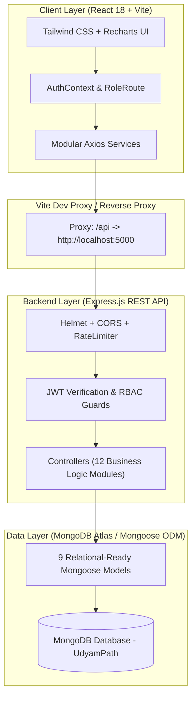
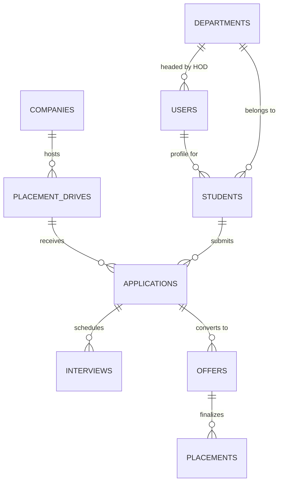

# 🎓 UdyamPath (उद्यमपथ)
> **From Campus to Career** — An Enterprise-Grade, Full-Stack MERN Placement Management Operating System.

[](https://github.com/rahuljiara/UdyamPath)
[](https://react.dev/)
[](https://vitejs.dev/)
[](https://nodejs.org/)
[](https://expressjs.com/)
[](https://www.mongodb.com/)
[](https://tailwindcss.com/)
[](LICENSE)

---

## 📌 Table of Contents
1. [Project Overview](#-1-project-overview)
2. [System Architecture](#-2-system-architecture)
3. [Core Feature Modules](#-3-core-feature-modules)
4. [Role-Based Access Control (RBAC)](#-4-role-based-access-control-rbac)
5. [Technology Stack](#-5-technology-stack)
6. [Repository Structure](#-6-repository-structure)
7. [Database Architecture & Seeder Engine](#-7-database-architecture--seeder-engine)
8. [REST API Reference](#-8-rest-api-reference)
9. [Getting Started & Installation](#-9-getting-started--installation)
10. [Demo Login Credentials](#-10-demo-login-credentials)
11. [Design System & Palette](#-11-design-system--palette)
12. [Author & License](#-12-author--license)

---

## 🌟 1. Project Overview

**UdyamPath** (*उद्यमपथ*) is a unified campus recruitment and placement management platform built specifically for universities, engineering institutes, Training & Placement Cells (TPOs), academic departments, corporate recruiters, and graduating students. 

The name is derived from the Sanskrit root **Udyam** (*उद्यम: purposeful effort, initiative, enterprise*) and **Path** (*पथ: journey, trajectory*):

$$\mathbf{\text{Effort (उद्यम)}} \longrightarrow \mathbf{\text{Direction (पथ)}} \longrightarrow \mathbf{\text{Opportunity}} \longrightarrow \mathbf{\text{Career}}$$

### Why UdyamPath?
Traditional placement cells suffer from fragmented Excel sheets, scattered Google Forms, unverified resume links, missed eligibility rules, and manual NIRF/NAAC reporting. **UdyamPath** centralizes the complete recruitment lifecycle into a high-performance, real-time operating system with role-based governance.

---

## 🏗️ 2. System Architecture



---

## ⚡ 3. Core Feature Modules

### 🏢 1. Training & Placement Officer (TPO) Hub
- **Executive KPI Dashboard**: Live stats for total candidates, placed count, placement percentage, active drives, average & highest package.
- **Placement Velocity & Trends**: Interactive charts for month-on-month hiring velocity, branch comparison, and salary tier distribution.
- **Recruitment Funnel**: Visual multi-stage candidate conversion from `Applied` $\rightarrow$ `Shortlisted` $\rightarrow$ `Interviewed` $\rightarrow$ `Offered` $\rightarrow$ `Placed`.
- **Accreditation Ready**: Instant calculation of metrics formatted for **NIRF**, **NAAC**, and **NBA** placement audits.

### 🎓 2. Student Portfolio & Opportunity Portal
- **Profile & Credential Verification**: Real-time academic tracking (10th/12th percentages, current CGPA, active backlogs, skills inventory).
- **Verified Portfolio Links**: One-click integration for verified GitHub, LinkedIn, Portfolio, and Hosted Resume URLs.
- **Live Drive Eligibility Engine**: Automated eligibility detection based on branch, graduation batch, minimum CGPA, and backlog limits.
- **Stage-by-Stage Application Tracker**: Real-time status cards for each applied company drive.

### 🏛️ 3. Head of Department (HOD) Portal
- **Department-Specific Oversight**: Filtered candidate visibility for respective departments (CSE, IT, ECE, EEE, MECH).
- **Branch Placement Ratios**: Track unplaced vs placed student counts, departmental average CTC, and top recruiters.
- **Candidate Verification**: Review and verify student academic credentials before external recruiter shortlisting.

### 🤝 4. Corporate Recruiter Portal
- **Drive Lifecycle Management**: Create job profiles, salary CTC packages (Base + Bonus), locations, and bond conditions.
- **Custom Assessment Rounds**: Define multi-round hiring pipelines (Online Coding Assessment, Technical Interview, HR Round).
- **Candidate Shortlisting & Feedback**: Review applicant profiles, filter by CGPA/skills, log interview scores, and release digital offer letters.

### 📊 5. Analytics & Reports Engine
- **Department-wise Analytics**: Comparative analysis of placement percentages across engineering streams.
- **Salary Tier Distribution**: Segmentation across Super Dream (> ₹20 LPA), Dream (₹10 - ₹20 LPA), and Core (₹4 - ₹10 LPA).
- **Gender & Demographic Placement Ratios**: Diversity metrics and hiring distributions.
- **Export Formats**: Data-dense tables and report previews ready for administrative audits.

---

## 🔐 4. Role-Based Access Control (RBAC)

| Resource / Action | ADMIN | TPO | HOD | RECRUITER | STUDENT |
| :--- | :---: | :---: | :---: | :---: | :---: |
| **System Settings & Audit Logs** | ✅ | ❌ | ❌ | ❌ | ❌ |
| **Global Placement Analytics** | ✅ | ✅ | ❌ (Dept Only) | ❌ | ❌ |
| **Create & Manage Placement Drives** | ✅ | ✅ | ❌ | ✅ (Own Drives) | ❌ |
| **Apply to Drives** | ❌ | ❌ | ❌ | ❌ | ✅ |
| **Schedule & Score Interviews** | ✅ | ✅ | ❌ | ✅ | ❌ (View Only) |
| **Issue Job Offers** | ✅ | ✅ | ❌ | ✅ | ❌ |
| **Accept / Reject Offer** | ❌ | ❌ | ❌ | ❌ | ✅ |
| **Verify Academic Profiles** | ✅ | ✅ | ✅ | ❌ | ❌ |
| **Generate NIRF/NAAC Reports** | ✅ | ✅ | ✅ (Dept Only) | ❌ | ❌ |

---

## 💻 5. Technology Stack

### Frontend Architecture
| Layer | Technology | Description |
| :--- | :--- | :--- |
| **Core Framework** | React.js 18 | Declarative component hierarchy with functional hooks |
| **Build Tool** | Vite 6 | Lightning-fast HMR and optimized ES module bundling |
| **Styling** | Tailwind CSS v3 | Design-token driven styling with responsive utilities |
| **Routing** | React Router v6 | Protected routes, role guards, and dynamic parameter routing |
| **Visualizations** | Recharts 2 | Responsive SVG charts (Bar, Line, Area, Pie, Funnel) |
| **Icons** | Lucide React | Lightweight, consistent iconography across all modules |
| **HTTP Client** | Axios | Request/response interceptors with automatic JWT bearer tokens |

### Backend Architecture
| Layer | Technology | Description |
| :--- | :--- | :--- |
| **Runtime** | Node.js (ES Modules) | High-throughput asynchronous runtime |
| **Web Framework** | Express.js 4.21 | Modular REST API routing and middleware pipelines |
| **Database** | MongoDB Atlas | Cloud-native NoSQL document store |
| **ODM** | Mongoose 8.23 | Strict schema definitions, compound indexes, population hooks |
| **Authentication** | JSON Web Tokens (JWT) | Stateless token-based auth with configurable expiration |
| **Password Hashing** | bcryptjs | Salted cryptographic hashing for user credentials |
| **Security Middleware** | Helmet, CORS, Rate-Limit | XSS protection, origin whitelisting, and brute-force mitigation |

---

## 📁 6. Repository Structure

```
UdyamPath/
├── client/                             # React.js + Vite Frontend Application
│   ├── public/                         # Static assets (Favicons, Logos, Icons)
│   ├── src/
│   │   ├── components/                 # Reusable UI & Layout Components
│   │   │   ├── common/                 # Buttons, Badges, Modals, Cards, Tables, Inputs
│   │   │   ├── dashboard/              # Funnel, KPI Cards, Velocity Charts, Schedulers
│   │   │   └── layout/                 # AppLayout, Header, Sidebar, Navigation
│   │   ├── context/                    # AuthContext & global state providers
│   │   ├── pages/                      # Role-tailored Page Views
│   │   │   ├── auth/                   # Login & Authentication view
│   │   │   ├── dashboard/              # TPO Executive Dashboard
│   │   │   ├── students/               # Student Directory & Profile Details
│   │   │   ├── companies/              # Recruiter Directory & Tier Profiles
│   │   │   ├── drives/                 # Placement Drives & Application Modals
│   │   │   ├── applications/           # Candidate Application Status Tracker
│   │   │   ├── interviews/             # Technical/HR Interview Scheduler
│   │   │   ├── offers/                 # Offer Management & Acceptance Workflow
│   │   │   ├── placements/             # Confirmed Placements & Archive
│   │   │   ├── analytics/              # Deep Analytics, Charts & Department Stats
│   │   │   └── reports/                # NIRF/NAAC Report Generator
│   │   ├── routes/                     # RoleRoute & AppRoutes navigation tree
│   │   ├── services/                   # Modular Axios API Service Clients
│   │   ├── styles/                     # Tailwind CSS entrypoint & custom utility classes
│   │   ├── App.jsx                     # Root React Component
│   │   └── main.jsx                    # React Virtual DOM Hydration
│   ├── package.json
│   ├── tailwind.config.js
│   └── vite.config.js                  # Vite configuration & /api proxy to port 5000
│
├── server/                             # Express.js REST API Server
│   ├── config/                         # Database connection & Atlas loader
│   ├── controllers/                    # 12 Specialized Controller Handlers
│   ├── middleware/                     # Auth guard, RBAC middleware, Error handler
│   ├── models/                         # 9 Strict Mongoose Relational Models
│   ├── routes/                         # Express REST API Route endpoints
│   ├── app.js                          # Express app configuration & middleware mounts
│   ├── server.js                       # Server entrypoint & port listener
│   └── package.json
│
├── database/                           # Modular Database Seeder & Data Backups
│   ├── config/                         # Connection & environment loader
│   ├── definitions/                    # Static staff, departments, companies, drives definitions
│   ├── seeders/                        # Modular collection seeders & dynamic aggregators
│   ├── data/                           # 9 Clean JSON collection backups
│   ├── seed.js                         # Master Seeder Entrypoint
│   └── package.json
│
├── DEMO_ACCOUNTS.txt                   # Complete login credentials reference directory
├── package.json                        # Monorepo root automation scripts
└── README.md                           # Master Project Documentation
```

---

## 🗄️ 7. Database Architecture & Seeder Engine

The system features **9 interconnected collections** configured with strict referential integrity, compound indexes, and dynamic statistical aggregation:



### Collection Inventory & Seeder Output

| # | Collection | Seed Count | Key Model Schema Fields |
| :-: | :--- | :-: | :--- |
| **1** | `users` | **110** | `name`, `email`, `password` (bcrypt), `role` (`ADMIN`, `TPO`, `HOD`, `STUDENT`, `RECRUITER`), `isActive` |
| **2** | `departments` | **5** | `name`, `code` (`CSE`, `IT`, `ECE`, `EEE`, `MECH`), `hod` (User ref), `intake`, `studentCount`, `averagePackage` |
| **3** | `companies` | **17** | `name`, `category` (Product, Service, Core), `tier` (Tier 1/2/3), `website`, `hrContacts`, `totalHires` |
| **4** | `students` | **100** | `user` (User ref), `rollNumber`, `department` (Dept ref), `cgpa`, `backlogs`, `skills`, `links`, `placementStatus` |
| **5** | `placementdrives` | **10** | `company` (Company ref), `title`, `packageDetails` (CTC, Base, Bonus), `eligibilityCriteria`, `status`, `rounds` |
| **6** | `applications` | **80** | `student` (Student ref), `drive` (Drive ref), `currentStage`, `status` (`Applied`, `Shortlisted`, `Selected`), `timeline` |
| **7** | `interviews` | **60** | `application` (App ref), `roundName`, `roundType` (Online/Offline), `scheduledDate`, `meetLink`, `feedback`, `status` |
| **8** | `offers` | **50** | `student` (Student ref), `company` (Company ref), `drive` (Drive ref), `ctc`, `status` (`Offered`, `Accepted`, `Rejected`) |
| **9** | `placements` | **50** | `student` (Student ref), `company` (Company ref), `package` (Numeric & formatted), `offerDate`, `joiningDate` |

> 💡 **One-Command Seeder**: Run `npm run seed` from root to automatically purge, construct, link, and aggregate metrics across all 9 collections into your MongoDB instance.

---

## 🔌 8. REST API Reference

All backend endpoints are prefixed with `/api` and return standardized JSON responses:

### 🔑 Authentication & Users (`/api/auth`, `/api/users`)
- `POST /api/auth/login` — Authenticate user and return JWT bearer token + profile.
- `GET /api/auth/me` — Retrieve currently authenticated user payload.
- `GET /api/users` — List all registered users (Admin/TPO only).
- `GET /api/users/:id` — Get specific user profile.

### 🏢 Departments & Companies (`/api/departments`, `/api/companies`)
- `GET /api/departments` — List all engineering departments with aggregated statistics.
- `GET /api/departments/:id` — Get department details, faculty head, and intake.
- `GET /api/companies` — Retrieve company directory with tier/category filters.
- `GET /api/companies/:id` — Get detailed company overview, hiring records, and past drives.
- `POST /api/companies` — Register new recruiter company.

### 🎓 Students & Academic Profiles (`/api/students`)
- `GET /api/students` — Query student directory with pagination, search, branch, CGPA, and status filters.
- `GET /api/students/:id` — Full student profile with verified links, applications, and offers.
- `PUT /api/students/:id` — Update student portfolio, CGPA, skills, or resume link.
- `GET /api/students/stats/summary` — Aggregate placement status metrics for student body.

### 🚀 Placement Drives & Applications (`/api/drives`, `/api/applications`)
- `GET /api/drives` — List active, upcoming, and completed placement drives.
- `GET /api/drives/:id` — Detailed drive profile, selection rounds, and eligibility requirements.
- `POST /api/drives` — Create new recruitment drive.
- `GET /api/applications` — Get candidate applications (filtered by student or drive).
- `POST /api/applications` — Submit application for an eligible drive.
- `PATCH /api/applications/:id/status` — Advance candidate stage (`Shortlisted`, `Rejected`, `Selected`).

### 📅 Interviews, Offers & Placements (`/api/interviews`, `/api/offers`, `/api/placements`)
- `GET /api/interviews` — List scheduled technical and HR interview rounds.
- `POST /api/interviews` — Schedule new interview round for an applicant.
- `GET /api/offers` — Retrieve all released job offer records.
- `PATCH /api/offers/:id/status` — Update offer status (`Accepted` / `Rejected`).
- `GET /api/placements` — Confirmed placement records for university audit and archive.

### 📊 Analytics & Reports (`/api/analytics`, `/api/reports`)
- `GET /api/analytics/overview` — High-level KPI summary, hiring velocity, and branch placement rates.
- `GET /api/analytics/departments` — In-depth departmental placement comparison.
- `GET /api/analytics/salary-distribution` — Tier-wise CTC package breakdown.
- `GET /api/reports/nirf` — Formatted data tables compliant with NIRF & NAAC reporting criteria.

---

## 🚀 9. Getting Started & Installation

### Prerequisites
- **Node.js**: v18.0.0 or higher ([Download](https://nodejs.org/))
- **npm**: v9.0.0 or higher
- **MongoDB**: Local MongoDB instance or free [MongoDB Atlas Cluster](https://www.mongodb.com/atlas)

---

### Step-by-Step Installation

#### 1. Clone the Repository
```bash
git clone https://github.com/rahuljiara/UdyamPath.git
cd UdyamPath
```

#### 2. Install Root, Frontend & Backend Dependencies
```bash
# Install root orchestration packages
npm install

# Install Frontend dependencies
cd client
npm install
cd ..

# Install Backend dependencies
cd server
npm install
cd ..
```

#### 3. Configure Environment Variables
Create a `.env` file inside the `server/` directory:

```env
PORT=5000
MONGO_URI=mongodb+srv://<username>:<password>@cluster0.mongodb.net/UdyamPath?retryWrites=true&w=majority
JWT_SECRET=udyampath_super_secret_jwt_key_2025
CLIENT_URL=http://localhost:3000
NODE_ENV=development
```

#### 4. Seed the Database with Pre-built Dataset
Populate all 9 collections (110 users, 100 students, 17 companies, 10 drives, applications, interviews, offers, placements):

```bash
npm run seed
```

#### 5. Launch the Application

You can start both servers simultaneously:

**Terminal 1 — Backend API:**
```bash
cd server
npm start
# Server starts on http://localhost:5000
```

**Terminal 2 — Frontend Client:**
```bash
cd client
npm run dev
# Frontend runs on http://localhost:3000
```

Open your browser and navigate to **[http://localhost:3000](http://localhost:3000)**.

---

## 🔑 10. Demo Login Credentials

> **Default Password for ALL Accounts:** `password123`

| Role | User Name | Email Address | Access & Capabilities |
| :--- | :--- | :--- | :--- |
| **👑 ADMIN / DIRECTOR** | Prof. Ramesh K. Verma | `admin@udyampath.com` | Full institutional access, audit logs, global permissions |
| **🎯 TPO DIRECTOR** | Dr. Rahul Deshmukh | `tpo.director@college.edu.in` | Drives management, shortlisting, analytics, NIRF reports |
| **🏛️ HOD (CSE)** | Dr. Arisudan Sharma | `hod.cse@college.edu.in` | Computer Science candidate reviews & department stats |
| **🏛️ HOD (IT)** | Dr. Meenakshi Sundaram | `hod.it@college.edu.in` | Information Technology branch management |
| **🏛️ HOD (ECE)** | Dr. Rajeshwar Rao | `hod.ece@college.edu.in` | Electronics & Communication branch management |
| **🏛️ HOD (EEE)** | Dr. Sunita Deshmukh | `hod.eee@college.edu.in` | Electrical & Electronics branch management |
| **🏛️ HOD (MECH)** | Dr. Vikramaditya Sen | `hod.mech@college.edu.in` | Mechanical Engineering branch management |
| **💼 RECRUITER (Microsoft)** | Sneha Kulkarni | `recruiter@microsoft.com` | Microsoft drive postings, applicant review & shortlisting |
| **💼 RECRUITER (Google)** | Anand Nair | `recruiter@google.com` | Google recruitment rounds & interview schedules |
| **💼 RECRUITER (TCS)** | Ramanathan Iyer | `recruiter@tcs.com` | Mass hiring drive management & candidate evaluation |
| **🎓 STUDENT (CSE - Placed)** | Rahul Sharma (9.42 CGPA) | `rahul.sha21@college.edu.in` | Student portal, applied drives, offer letter viewer |
| **🎓 STUDENT (IT - Applied)** | Pooja Iyer (7.64 CGPA) | `pooja.iye52@college.edu.in` | Drive discovery, eligibility check, application submission |

*(See [DEMO_ACCOUNTS.txt](DEMO_ACCOUNTS.txt) for the complete directory of all 100+ student and staff credentials).*

---

## 🎨 11. Design System & Palette

UdyamPath follows a curated enterprise palette tailored for high-density academic and recruitment operations:

| Design Token | Hex Code | Preview | Purpose & Application |
| :--- | :---: | :---: | :--- |
| **Primary (Teal)** | `#2F8F78` |  | Primary action buttons, active navigation states, brand accents |
| **Primary Dark** | `#24715F` |  | Button hover states, prominent headers |
| **Primary Soft** | `#E8F5F1` |  | Active link backgrounds, soft status tags, highlight cards |
| **Surface** | `#FFFFFF` |  | Cards, modal sheets, tables, floating dropdowns |
| **Background** | `#F8FAFC` |  | Clean, glare-free application canvas |
| **Text Primary** | `#0F172A` |  | High-contrast data figures, titles, and headers |
| **Text Secondary** | `#64748B` |  | Secondary metadata, labels, and timestamps |
| **Border** | `#E2E8F0` |  | Crisp dividers and card borders |

---

## 👨‍💻 12. Author & License

- **Developer / Maintainer**: [Rahul Sharma](https://github.com/rahuljiara)
- **Repository**: [https://github.com/rahuljiara/UdyamPath](https://github.com/rahuljiara/UdyamPath)
- **License**: Licensed under the [ISC License](LICENSE).

---

<p align="center">
  <b>UdyamPath</b> — Empowering campus talent from first application to final offer letter. 🚀
</p>
